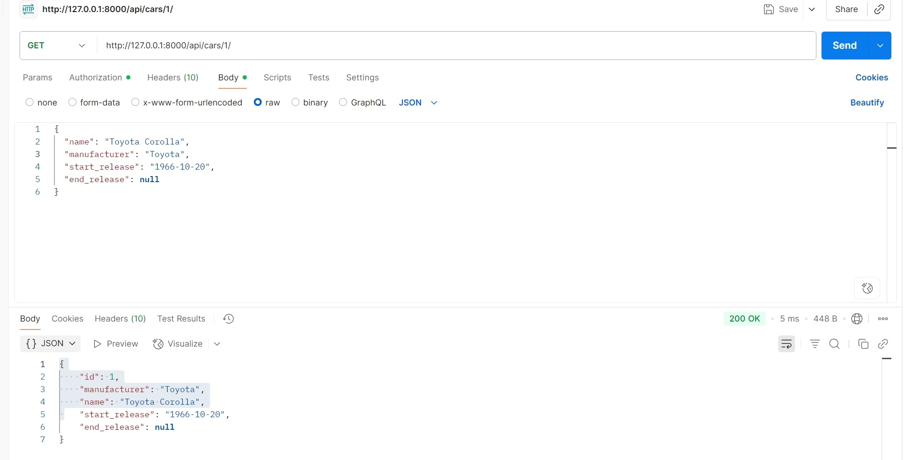
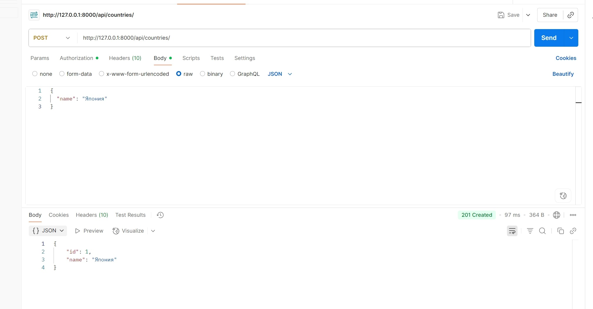
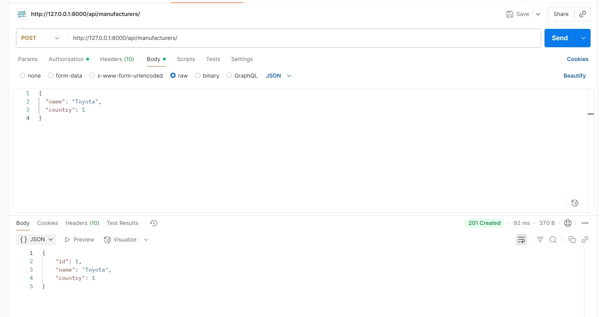
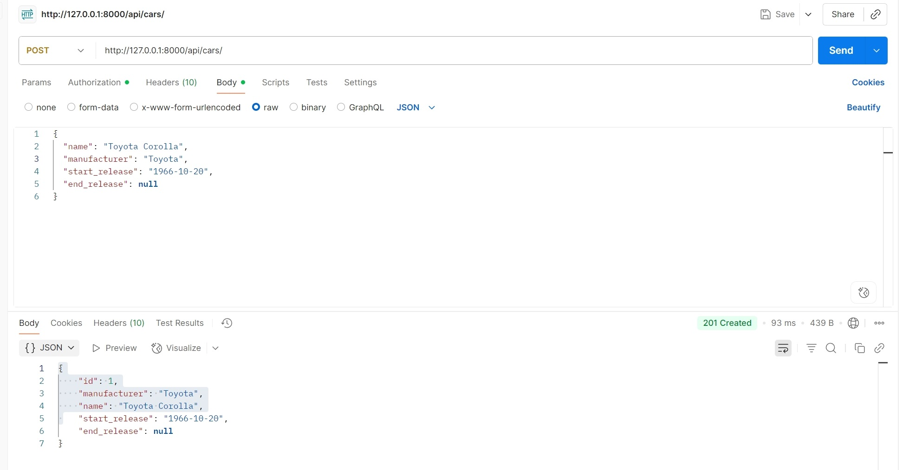
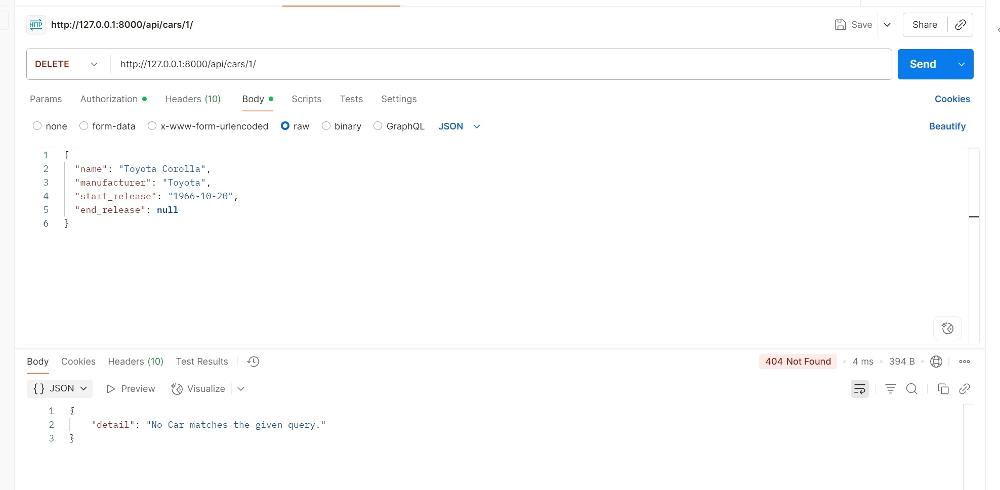
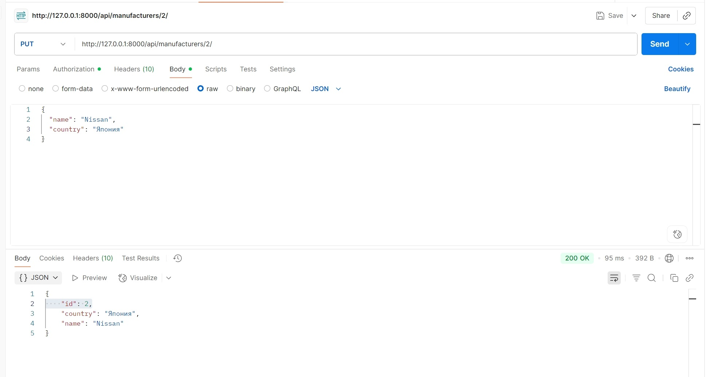
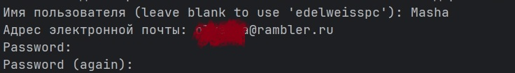
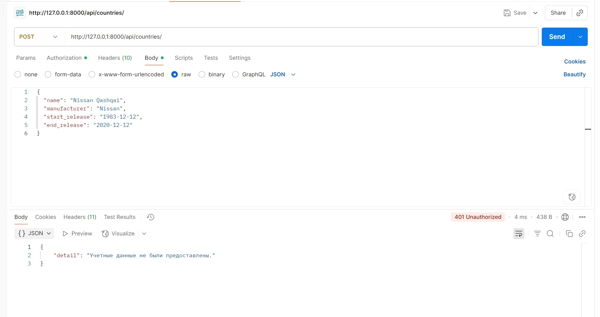

 Приложение по автомобилям, основанное на 4-х моделях. Сериалайзеры настроены согласно заданию.
 Само приложение называется cars (файлы в папке cars), запуск идет через manage.py (или в bash python manage.py runserver).
 
CRUD работает с помощью встроенного модуля ModelViewSet, используемого во вьюшках. 
Руты выглядят так: http://127.0.0.1:8000/api/cars/ или в конце можно поставить id: http://127.0.0.1:8000/api/cars/1/

Все остальные руты так же используют ссылку, только после указания порта указываются следующие поинты:

/api/cars/

/api/countries/

/api/manufacturers/

/api/comments/

Так же прикрепляю скрины CRUD с тестами из Postman.

GET-запрос:

POST-запросы:

DELETE-запрос:

PUT-запрос:

Конечно, здесь действует ограничение прав согласно заданию: редактирование, удаление и добавление данных разрешено только при наличии специального токена. 
Его получаем, используя команду python manage.py createsuperuser. Далее пишем имя суперпользователя, его почту и 2 раза пароль (его не видно настройками приватности). 

Чтобы получить токен на уже созданного суперпользователя используем python manage.py drf_create_token <имя пользователя>
При использовании того же Postman, POST, PUT, DELETE запросы возможны только с помощью токена. GET-запрос доступен всем. Доступ к POST и GET комментариям доступны всем.

Административные ограничения прописаны в permissions.py.

Так же в приложении реализован экспорт данных в .cvs и в .xlsx.
Все делается через запросы:
http://127.0.0.1:8000/api/export/?model=cars&file=xlsx

http://127.0.0.1:8000/api/export/?model=cars&file=cvs

model= <-- сюда подставляется любая из 4-х моделей (manufacturers, cars, comments, countries).
Если использовать ссылки в браузере, то они скачивают файл в нужном разрешении, в Postman просто покажет данные в кодировке.

Для этой вьюшки был создан отвельный файл - export_views.py, так же руты для него были прописаны отдельно в export_urls.py.

Так же в проекте присутствует Dockerfile, весь проект с нужными зависимостями можно распоковать. 
